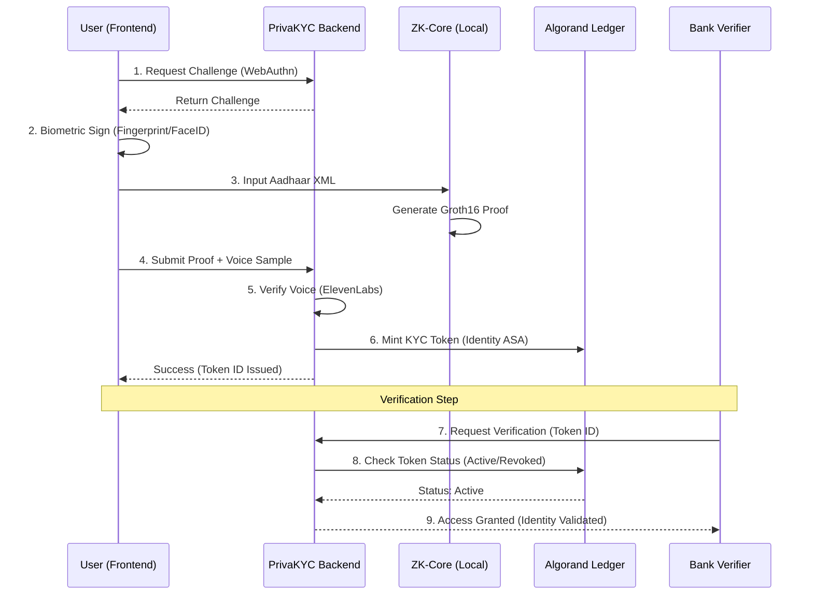

# User & Data Flow - PrivaKYC

This document visualizes the high-integrity flow of data from the User to the Verifier (Bank) using the PrivaKYC protocol.

## 🔄 The KYC Lifecycle

## 🛠️ Components Mapping
- **Step 3 (ZK Generation)**: Handled by `/zk-core/circuits/age_proof.circom`.
- **Step 6 (Minting)**: Handled by `/backend/src/services/algorand/algorandService.js`.
- **Step 8 (Status)**: Queries the Algorand Indexer via `/backend/src/routes/algorand.routes.js`.
