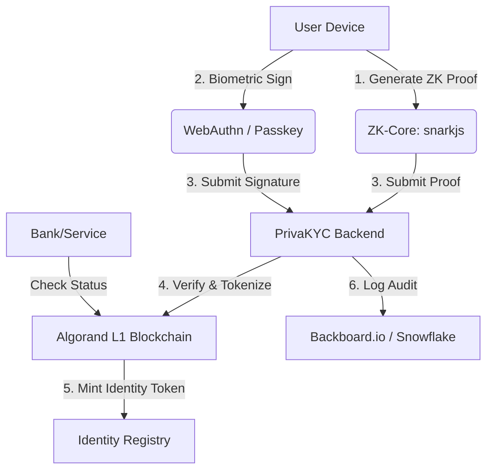

# 🛡️ PrivaKYC: Privacy-Preserving Zero Knowledge Identity Protocol

[](https://www.algorand.com/)
[](https://snarkjs.com/)
[](https://webauthn.io/)
[](https://opensource.org/licenses/MIT)

**PrivaKYC** is a next-generation identity protocol that eliminates the need to share raw sensitive data during KYC. By leveraging **Zero-Knowledge Proofs (ZKP)**, **Biometric Passkeys (FIDO2)**, and **Algorand Blockchain**, PrivaKYC ensures that your identity is cryptographically verifiable while remaining 100% private.

---

## 🌟 Vision
Traditional KYC systems force users to upload raw Aadhaar cards, Passports, and personal info to centralized databases—creating massive honey-pots for hackers. **PrivaKYC flips the script.** 

> "Verify your age, nationality, and identity—without ever revealing who you are."

---

## 🚀 Technical Innovation

### 1. 🧙‍♂️ Localized ZK-Proof Generation
Using **Circom** and **snarkjs**, we generate Groth16 proofs directly in the user's browser. This proves attributes (e.g., "Age > 18", "Country = India") against Government-signed data (Aadhaar XML) without the private data ever leaving the device.

### 2. ⛓️ Algorand On-Chain Tokenization
Identity status is tokenized on the **Algorand Blockchain** as a non-transferable, revocable asset. This provides banks with a single source of truth for identity validity without needing to store PII.

### 3. 🎙️ Multi-Modal Biometrics
Integration with **WebAuthn** for hardware-bound device signing and **ElevenLabs** for voice liveness verification, creating a "Proof of Personhood" layer that prevents AI deepfakes and identity theft.

### 4. ⚡ Real-Time Fraud Intelligence
Powered by a proprietary **Risk Engine** that integrates with **Snowflake** for fraud heatmap analysis and **Backboard.io** for immutable agent memory logging.

---

## 🏗️ Architecture Overview



---

## 📂 Repository Roadmap

| Component | Technology | Description |
| :--- | :--- | :--- |
| **`frontend/`** | React + Vite + Framer Motion | High-performance SPA with cinematic UI. |
| **`backend/`** | Node.js + Express + MongoDB | Orchestration layer and API gateway. |
| **`zk-core/`** | Circom + Docker | Circuits for age and identity verification. |
| **`integrations/`** | Sponsor Modules | ElevenLabs, Snowflake, and Algorand services. |

---

## 🛠️ Setup & Installation

### Prerequisites
- Node.js v18+
- MongoDB (Local or Atlas)
- Algorand Testnet Account (Sponsor Mnemonic)

### Quick Start
1. **Clone the repository**:
   ```bash
   git clone https://github.com/KishanYU/PrivaKYC.git
   cd PrivaKYC
   ```

2. **Initialize Backend**:
   ```bash
   cd backend
   npm install
   cp .env.example .env # Add your keys
   npm run dev
   ```

3. **Initialize Frontend**:
   ```bash
   cd ../frontend
   npm install
   npm run dev
   ```

---

## 🧪 Testing the "Wow" Factor
1. Navigate to the **[Live Demo](https://priva-kyc.vercel.app)**.
2. Select **DigiLocker** or **XML Upload**.
3. Watch the local **ZK-Proof generator** in action.
4. **Bind your device** using your phone's biometrics (WebAuthn).
5. Trigger an **Emergency Revocation** and observe the real-time Algorand on-chain update and n8n webhook alert.

---

## 🤝 Contribution
Contributions are welcome! Please see our **[CONTRIBUTING.md](./CONTRIBUTING.md)** for details.

---

## 📜 License
This project is licensed under the **MIT License** - see the **[LICENSE](./LICENSE)** file for details.

---
*Built with ❤️ for the Hackathon. Empowering the next billion users with Private Identity.*
